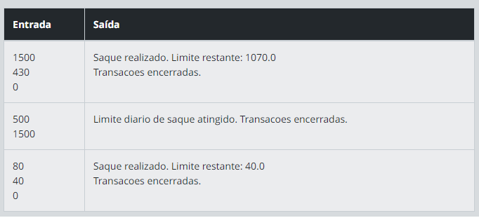

# Descrição
Você está desenvolvendo um programa simples em Java para auxiliar um cliente a realizar saques de uma conta bancária. O cliente pode fazer saques até atingir um limite diário predefinido.

# Entrada
O programa solicitará ao usuário que informe o limite diário de saque.
Em seguida, o programa solicitará ao usuário que informe o valor do primeiro saque.
# Saída
Utilizando um laço for, o programa iterará sobre os saques.
Para cada saque, o programa verificará se o valor ultrapassa o limite diário.
Se ultrapassar, o programa informará que o limite foi atingido e encerrará o loop.
Se não ultrapassar, o programa informará que o saque foi realizado com sucesso.
Exemplos
A tabela abaixo apresenta exemplos com alguns dados de entrada e suas respectivas saídas esperadas. Certifique-se de testar seu programa com esses exemplos e com outros casos possíveis.

